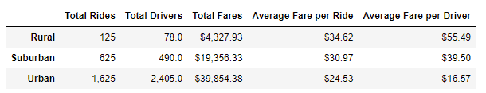

# PyBer_Analysis
## Overview
PyBer, a python ride sharing companay, has requested us to perform an exploratory analysis on a database containing various ride sharing information on multiple cities. The information this database contains includes data such as:
- The city a rideshare service took place
- The date and time it was completed
- The fare cost 
- The unique ride id
- The type of city it was in (Urban/ Suburban/ Rural)
- And the amount of ride share drivers that are within the same city
The use of analysis visualizations aim to help PyBer's understand key differences between the three different city types and their respective average weekly fares. We will also suggests data informed buisiness changes that may benefit the company 

## Results
### Pyber City Types Analysis

### Total Fare by City Type Graph

We can see some majore key differences here between the three different city types when it comes to ride sharing services:
1. We can see that as cities grow more urban, services significantly increase. 
2. We can see that drivers in Urban cities, due to there being significantly more drivers, the average fare they earn is significantly less.
3. We can also see that the average fares in less urban cities tend to cost more than that of Urban cities.
4. In less Urban cities, there tends to be significantly less drivers available for ride shares.
5. In less Urban cities, the amount these ride share services earn are significantly less than that earned in urban cities.

## Summary
In summary with these findings we can suggest a few business recommendations:
1. The service fare in Urban cities are significantly high, but the average fare earned by the drivers are relatively small. One way to combat this so that the drivers are properly earning the amount they deserve is by cutting the amount of drivers they have in the city. There is too many drivers out lowering the wages they can earn.
2. Another thing we can aim on improving is the average fare for rides in non urban cities. The relative low rides may be due to the price - lowering the price may encourage more rides and decreasing the amount fares earned may also encourage more workers.
3. Last suggestion is to lower the average fare per ride by lowering the average fare drivers earn in non urban cities.
